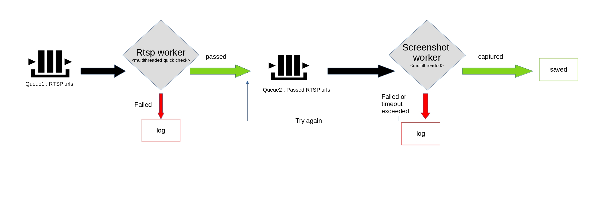

# What is the Purpose of this tool?
The purpose of this tool is finding RTSP urls assuming we have known target with specified credentials.

Created with a lot of help from https://gitlab.com/woolf/RTSPbrute

Similar tools:
- https://gitlab.com/woolf/RTSPbrute
- https://github.com/Ullaakut/cameradar

# How to use?
- you need at least python 3.9

- first clone the master branch:

		git clone https://gitlab.com/erfanara/rtsp_finder --depth 1

		cd rtsp_finder

- install the requirements :

		pip install -r requirements.txt

- now you can run the tool:

		python -m rtspFinder -i <ip> -u <username> -p <passowrd>

                for example:
		python -m rtspFinder -i 192.168.1.2 -u "admin" -p "123456"

# How it works?

