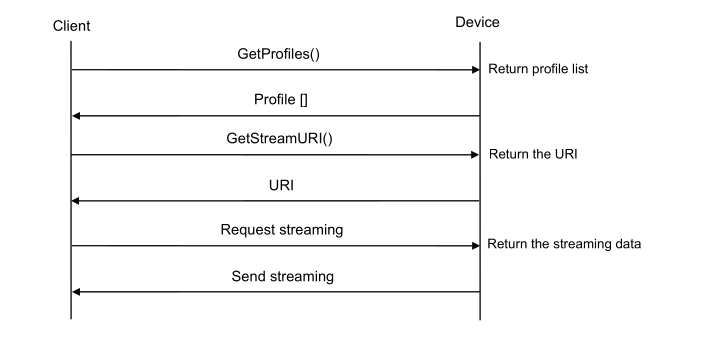

Onvif

# How to get rtsp links from an Onvif device?

if you take a look at ONVIF Application Programmer's Guide pdf , in the section of streaming using an existing media profile you will see this :


A device with a media configuration service enabled includes at least one media profile at boot. so we can use that profile at least.

The question is how should we send GetProfiles Request to the Onvif device?
That would be so easy, if we were familiar with Onvif api. se let's talk about Onvif api and how to intract with it.

## Onvif api
- uses HTTP protocol 
- all of your requests should use HTTP POST (or GET sometimes ?) method
- in many situations uses HTTP digest for authentication , so you should have the credentials to be able to work with the api
- The body of http packet should use xml data type (SOAP) and you actually send your request data in this format
- The entry point for the device management service is fixed to: `http://onvif_host/onvif/device_service` so you should send your requests about device_service to this url, but for example if you have media requests you should send your request to `http://onvif_host/onvif/media_service`
- xml elements have a namespace url that your request should match with that namespace like previous tip (take a look at WSDL overview and namespaces in Onvif core specification pdf for more info)
- you can find what services and functionalities onvif provide in the Onvif spec pdfs. (take a look at [wikipedia](https://en.wikipedia.org/wiki/ONVIF#Specification) and [Onvif website](https://www.onvif.org/profiles-add-ons-specifications/))
also take a look at http://www.onvif.org/onvif/ver20/util/operationIndex.html
- also their is a tool , `Onvif test tool`, helps you test an Onvif device and provides good xml examples
- you can also use insomnia/postman or any similar tool that can generate HTTP request but you should have body of the HTTP request... 
- also their is ready to use libraries or tools for Onvif that let you interact with camera without knowing the Onvif api (for example: https://github.com/FalkTannhaeuser/python-onvif-zeep or valkka library) (https://github.com/xris-hu/gsoap-onvif) 

## GetProfiles()

- request body:
```
<s:Envelope xmlns:s="http://www.w3.org/2003/05/soap-envelope">
  <s:Body xmlns:xsi="http://www.w3.org/2001/XMLSchema-instance" xmlns:xsd="http://www.w3.org/2001/XMLSchema">
    <GetProfiles xmlns="http://www.onvif.org/ver10/media/wsdl" />
  </s:Body>
</s:Envelope>
```
now you have a ready-to-use request body (also this is what wsdl files are for), the only thing you should be aware of is request headers.
request headers are important if device needs http digest auth and if you want to send request with libraries like request(python). (take a look at getRtspUsingOnvif.py and Http digest auth doc)

- response body example:
```
<?xml version="1.0" encoding="UTF-8"?>
<SOAP-ENV:Envelope xmlns:SOAP-ENV="http://www.w3.org/2003/05/soap-envelope" xmlns:SOAP-ENC="http://www.w3.org/2003/05/soap-encoding" xmlns:xsi="http://www.w3.org/2001/XMLSchema-instance" xmlns:xsd="http://www.w3.org/2001/XMLSchema" xmlns:c14n="http://www.w3.org/2001/10/xml-exc-c14n#" xmlns:ds="http://www.w3.org/2000/09/xmldsig#" xmlns:saml1="urn:oasis:names:tc:SAML:1.0:assertion" xmlns:saml2="urn:oasis:names:tc:SAML:2.0:assertion" xmlns:wsu="http://docs.oasis-open.org/wss/2004/01/oasis-200401-wss-wssecurity-utility-1.0.xsd" xmlns:xenc="http://www.w3.org/2001/04/xmlenc#" xmlns:wsc="http://docs.oasis-open.org/ws-sx/ws-secureconversation/200512" xmlns:wsse="http://docs.oasis-open.org/wss/2004/01/oasis-200401-wss-wssecurity-secext-1.0.xsd" xmlns:wsa="http://schemas.xmlsoap.org/ws/2004/08/addressing" xmlns:wsdd="http://schemas.xmlsoap.org/ws/2005/04/discovery" xmlns:chan="http://schemas.microsoft.com/ws/2005/02/duplex" xmlns:wsa5="http://www.w3.org/2005/08/addressing" xmlns:tns1="http://www.onvif.org/ver10/topics" xmlns:ter="http://www.onvif.org/ver10/error" xmlns:xmime="http://tempuri.org/xmime.xsd" xmlns:xop="http://www.w3.org/2004/08/xop/include" xmlns:ovf="http://www.artosyn.cn/ovf" xmlns:wsrfbf="http://docs.oasis-open.org/wsrf/bf-2" xmlns:wstop="http://docs.oasis-open.org/wsn/t-1" xmlns:tt="http://www.onvif.org/ver10/schema" xmlns:wsrfr="http://docs.oasis-open.org/wsrf/r-2" xmlns:tdn="http://www.onvif.org/ver10/network/wsdl" xmlns:tds="http://www.onvif.org/ver10/device/wsdl" xmlns:tev="http://www.onvif.org/ver10/events/wsdl" xmlns:wsnt="http://docs.oasis-open.org/wsn/b-2" xmlns:timg="http://www.onvif.org/ver20/imaging/wsdl" xmlns:tmd="http://www.onvif.org/ver10/deviceIO/wsdl" xmlns:tptz="http://www.onvif.org/ver20/ptz/wsdl" xmlns:tr2="http://www.onvif.org/ver20/media/wsdl" xmlns:trt="http://www.onvif.org/ver10/media/wsdl">
    <SOAP-ENV:Body>
        <trt:GetProfilesResponse>
            <trt:Profiles token="prof_major" fixed="true">
                <tt:Name>prof_major</tt:Name>
                <tt:VideoSourceConfiguration token="vsc_0">
                    <tt:Name>vsc_0</tt:Name>
                    <tt:UseCount>1</tt:UseCount>
                    <tt:SourceToken>vs_0</tt:SourceToken>
                    <tt:Bounds x="0" y="0" width="1920" height="1080"></tt:Bounds>
                </tt:VideoSourceConfiguration>
                <tt:VideoEncoderConfiguration token="vec_major">
                    <tt:Name>vec_major</tt:Name>
                    <tt:UseCount>1</tt:UseCount>
                    <tt:Encoding>H264</tt:Encoding>
                    <tt:Resolution>
                        <tt:Width>1280</tt:Width>
                        <tt:Height>720</tt:Height>
                    </tt:Resolution>
                    <tt:Quality>3072</tt:Quality>
                    <tt:RateControl>
                        <tt:FrameRateLimit>25</tt:FrameRateLimit>
                        <tt:EncodingInterval>0</tt:EncodingInterval>
                        <tt:BitrateLimit>3072</tt:BitrateLimit>
                    </tt:RateControl>
                    <tt:H264>
                        <tt:GovLength>60</tt:GovLength>
                        <tt:H264Profile>Baseline</tt:H264Profile>
                    </tt:H264>
                    <tt:Multicast>
                        <tt:Address>
                            <tt:Type>IPv4</tt:Type>
                            <tt:IPv4Address>0.0.0.0</tt:IPv4Address>
                        </tt:Address>
                        <tt:Port>8554</tt:Port>
                        <tt:TTL>60</tt:TTL>
                        <tt:AutoStart>false</tt:AutoStart>
                    </tt:Multicast>
                    <tt:SessionTimeout>PT60S</tt:SessionTimeout>
                </tt:VideoEncoderConfiguration>
            </trt:Profiles>
            <trt:Profiles token="prof_minor" fixed="true">
                <tt:Name>prof_minor</tt:Name>
                <tt:VideoSourceConfiguration token="vsc_0">
                    <tt:Name>vsc_0</tt:Name>
                    <tt:UseCount>1</tt:UseCount>
                    <tt:SourceToken>vs_0</tt:SourceToken>
                    <tt:Bounds x="0" y="0" width="1920" height="1080"></tt:Bounds>
                </tt:VideoSourceConfiguration>
                <tt:VideoEncoderConfiguration token="vec_minor">
                    <tt:Name>vec_minor</tt:Name>
                    <tt:UseCount>1</tt:UseCount>
                    <tt:Encoding>H264</tt:Encoding>
                    <tt:Resolution>
                        <tt:Width>0</tt:Width>
                        <tt:Height>0</tt:Height>
                    </tt:Resolution>
                    <tt:Quality>7168</tt:Quality>
                    <tt:RateControl>
                        <tt:FrameRateLimit>0</tt:FrameRateLimit>
                        <tt:EncodingInterval>0</tt:EncodingInterval>
                        <tt:BitrateLimit>7168</tt:BitrateLimit>
                    </tt:RateControl>
                    <tt:H264>
                        <tt:GovLength>60</tt:GovLength>
                        <tt:H264Profile>Baseline</tt:H264Profile>
                    </tt:H264>
                    <tt:Multicast>
                        <tt:Address>
                            <tt:Type>IPv4</tt:Type>
                            <tt:IPv4Address>0.0.0.0</tt:IPv4Address>
                        </tt:Address>
                        <tt:Port>8554</tt:Port>
                        <tt:TTL>60</tt:TTL>
                        <tt:AutoStart>false</tt:AutoStart>
                    </tt:Multicast>
                    <tt:SessionTimeout>PT60S</tt:SessionTimeout>
                </tt:VideoEncoderConfiguration>
            </trt:Profiles>
        </trt:GetProfilesResponse>
    </SOAP-ENV:Body>
</SOAP-ENV:Envelope>
```
what you need from the response body is the profile tokens like :  `prof_major`, `prof_minor` in this example.

## GetStreamURI()
- request body:
```
<s:Envelope xmlns:s="http://www.w3.org/2003/05/soap-envelope">
  <s:Body xmlns:xsi="http://www.w3.org/2001/XMLSchema-instance" xmlns:xsd="http://www.w3.org/2001/XMLSchema">
    <GetStreamUri xmlns="http://www.onvif.org/ver10/media/wsdl">
      <StreamSetup>
        <Stream xmlns="http://www.onvif.org/ver10/schema">RTP-Unicast</Stream>
        <Transport xmlns="http://www.onvif.org/ver10/schema">
          <Protocol>RTSP</Protocol>
        </Transport>
      </StreamSetup>
      <ProfileToken>prof_major</ProfileToken>
    </GetStreamUri>
  </s:Body>
</s:Envelope>
```
- response body example:
((the device should send a rtsp link for example ...))

## Streaming using rtsp
after you find the RTSP link , then you can get stream data from your device.
- tools or libraries that support RTSP:
	* ffmpeg
	* av (python, ...)
	* opencv (c++, python)
	* ...

many video players use similar libraries as a result they'll play the stream if you give them RTSP link.
# What if that device does not support the Onvif?
In that case you may have some trouble ro find the Stream link, since every device has it's specific URI.
but their is some efforts to find the RTSP link ...

* tools that help you :
	- https://github.com/erfanara/rtspFinder
	- https://github.com/Ullaakut/cameradar
	- https://gitlab.com/woolf/RTSPbrute


# What if that device does not support the rtsp?
Since every device may has it's own protocol to stream the data you have not a general solution.
